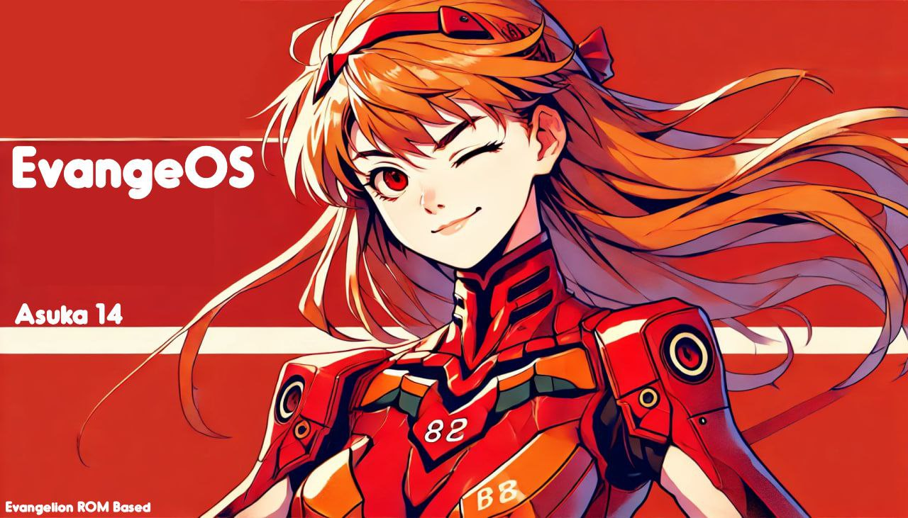

# **Evange Project**

**Evange Project is a custom ROM inspired by the world of Neon Genesis Evangelion. This project aims to bring a unique visual and thematic experience to users, blending mobile customization with the iconic aesthetic and deep symbolism of Evangelion.**

Each build of Evange Project is dedicated to a specific character from the anime, featuring themes, wallpapers, and customizations inspired by the character's personality and visual style. Additionally, the project stays updated with the latest security patches and performance enhancements to ensure an optimized and secure experience.

### Key Features
- Exclusive Themes: Each build includes a theme inspired by an Evangelion character.
- Customized Visual Experience: Icons, wallpapers, fonts, and colors adapted to match the character's theme.
- Optimization and Security: Regular updates to keep the device fast and secure.
- Performance Enhancements: Focused on a smooth and responsive system, prioritizing user experience.
- Characters and Builds
- Each new build pays homage to a character from Evangelion, bringing fresh aesthetics and personalized features, allowing anime fans to dive into the character's universe with every update.

### Contribution

Contributions are welcome! If you're an Evangelion fan and want to help improve Evange Project, feel free to open issues, make pull requests, and suggest new ideas.💖

[Pedropcrdp242](https://github.com/Pedropcrdp242)
